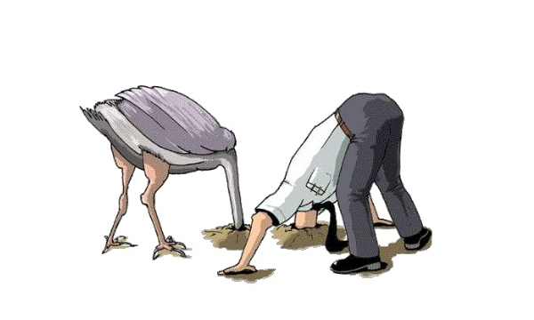

# Wie wir uns selbst zur Klimakrise belügen - erklärt mit Kognitionspsychologie

{.floatright}

Wir hören sie täglich, die Ausreden und schlauen Erklärungen gegen die Klimakrise.

> Klima? - Da denk ich lieber gar nicht drüber nach!“

Die Kognitionspsychologie beschäftigt sich insbesondere mit all jenen psychischen Vorgängen, die mit Wahrnehmung, Erkenntnis und Wissen zu tun haben.

Hier erklärt die Kognitionspsychologie die internen Gedankengänge, in Menschen die diese Aussagen tätigen sehr gut. Und wenn wir diese Prinzipien verstehen, dann können wir auch besser damit umgehen.

[teaserbreak]
Im wesentlichen geht es immer um die interne Abwehr der unangenehmen Gedanken.

## Los geht’s mit den Klimaleugner-Sprüchen

> Klima? - Da denk ich lieber gar nicht drüber nach!“

▶️ Klassische Vermeidung / Avoidance - Unangenehmes wird aus der bewussten Wahrnehmung ausgeschlossen z.B. durch Ablenkung

> "Ich hab einen Artikel zu natürlichen Klimaschwankungen gelesen. Später dann noch ein gefaktes Bild schmelzender Polkappen. Was für eine #Klimahysterie!“

▶️ Bestätigungsfehler / Confirmation Bias: Neigung, Infos so auszuwählen, dass sie die eigenen Erwartungen bestätigen.

> Ich selbst mach eh schon genug“

▶️Selbstwertdienliche Verzerrung: Attribution von Erfolgen auf das Selbst und von Misserfolgen auf äußere Umstände.
Klimaschädliches Verhalten wird mit Verweis auf eigenen klimafreundliches Verhalten gerechtfertigt.

> "Wird schon nicht so schlimm!“

▶️Optimistische Verzerrung / Optimism Bias: Glaube, dass einem selbst weniger Negatives passieren werde als anderen oder vorhergesagt.

> "Ich bin Vegetarier und fahr Fahrrad. Da find ich es ok, ab und zu zu fliegen.“

▶️Moralische Lizensierung / Moral Licensing: „Gute Taten“ vermindern spätere Schuldgefühle für „schlechte Taten“

> "Wenn Asien weiter Kohlekraftwerke baut, bringt das eh nix, was wir hier machen!“

▶️Schuldverschiebung / Blame shifting: Die Schuld / Verantwortung wird bei anderen verortet, eigene Anteile werden ausgeblendet.

> "Warum soll ich streiken gehen, das machen doch schon die Jugendlichen!“

▶️Verantwortungsdiffusion/ Diffusion of Responsibility: Je mehr Menschen in einer Gruppe, desto kleiner die wahrgenommene individuelle Verantwortung.

Quelle: Psychologists for Future @Psychologists4F [Twitter](https://twitter.com/Psychologists4F/status/1202157913206329344)

Bild: https://web.colby.edu/cogblog/2017/05/07/what-do-ostriches-and-finance-have-in-common/

